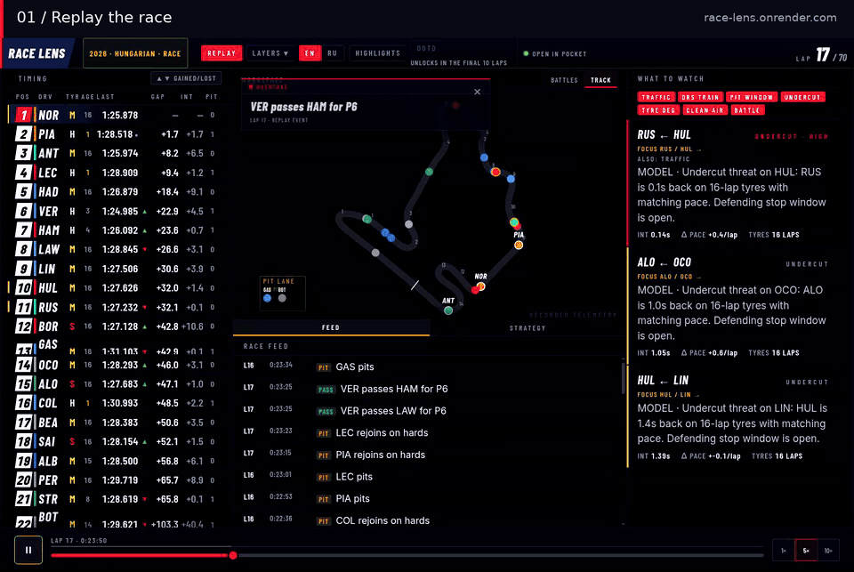

<h1 align="center">🏎️ RACE LENS</h1>

<p align="center"><strong>Pause the chaos. See why the race moved.</strong></p>

<p align="center">
  <a href="https://github.com/fearlesstilted/race-lens/actions/workflows/ci.yml"></a>
  <a href="LICENSE"></a>
</p>

<p align="center"><strong><a href="https://race-lens.onrender.com">Open the live demo</a></strong></p>

Race Lens is my motorsport engineering playground: part replay machine, part
broadcast desk, part strategy rabbit hole. Pick a session, scrub to any moment,
and inspect timing, battles, tyres, radio, incidents, and the calls that shaped
the race.

[](docs/media/race-lens-demo.mp4)

**22-second walkthrough:** replay → driver focus → timeline scrubbing.
[Watch the MP4](docs/media/race-lens-demo.mp4) · [Try it yourself](https://race-lens.onrender.com/?session=hungarian_2026_race)

Under the hood it stays deliberately deterministic: the same event timeline at
the same timestamp always produces the same race state. That makes the fun UI
inspectable instead of magical.

```text
recorded event fixtures
       ↓
normalized event timeline
       ↓
deterministic replay engine
       ↓
REST + SSE → React broadcast UI
       ↓
insights, commentary, highlights, and experimental strategy tools
```

Missing archives use a second, deliberately small path:

```text
browser canonical ID → Render request object → Debian worker
                         ↑ status/manifest ← verified private triplet
```

The final manifest is the readiness marker. Render downloads a remote triplet
to a bounded `/tmp` cache and checks every declared size and SHA-256 before the
existing replay engine sees it.

This is a personal project, not a commercial timing product and definitely not
a betting oracle. The point is to build the F1 viewer I want to poke at, while
keeping the data pipeline, heuristics, and replay behavior honest.

## Try the demo

Open [race-lens.onrender.com](https://race-lens.onrender.com). The free instance
may take up to a minute to wake after inactivity; the UI keeps the selected
session and shows the wake-up stage instead of a local development error.

Choose your surface:

- **Web:** open the link above; nothing to install.
- **Windows:** download the unsigned x64 installer from
  [Desktop v0.1.0](https://github.com/fearlesstilted/race-lens/releases/tag/desktop-v0.1.0).
  It is a pre-release, so Windows SmartScreen may ask for confirmation.
- **Terminal:** install the read-only
  [TUI v0.1.0](https://github.com/fearlesstilted/race-lens/releases/tag/tui-v0.1.0)
  on Python 3.11+ and point it at the public API:

  ```bash
  python -m pip install "racelens[tui] @ https://github.com/fearlesstilted/race-lens/releases/download/tui-v0.1.0/racelens-0.1.0-py3-none-any.whl"
  racelens-tui --api-url https://race-lens.onrender.com
  ```

Open the app without a session to get the interactive catalog, or click the
session name in the header to switch. Completed practice, sprint, qualifying,
and race sessions from the full-telemetry era (2018 onward) are available.
Sessions already in the demo open immediately. With private S3-compatible
storage configured, a missing session is queued once for the outbound-only
Debian worker; its verified replay becomes available without a Git data commit.
Without storage, writable local deployments retain the small filesystem queue
and the public demo stays bounded.

To run it locally:

```bash
docker compose up --build
```

Then open:

- UI: http://localhost:5173
- API docs: http://localhost:8000/docs

Start with **Bahrain 2021** for the strategy duel, **Germany 2019** for wet
chaos, or the **Hungary 2026 race** for the current full-workspace demo. The
catalog is the source of truth for what is ready right now.

The root `Dockerfile` builds a single public-demo image on port `7860`.
It runs as a non-root user with `RACELENS_READONLY=1`, so public deployments
cannot start capture jobs or write fixtures. Read-only mode may write only a
bounded canonical preparation request when private object storage is configured.

## What it demonstrates

- A typed event envelope shared by replay fixtures and optional data adapters.
- Stable event IDs, deterministic ordering, deduplication, and snapshots.
- Timestamp-scoped replay with no future-data leakage.
- FastAPI REST endpoints and Server-Sent Events for replay and near-live modes.
- Rule-based race insights and deterministic EN/RU commentary.
- A React + TypeScript broadcast UI with timing, track, feed, and strategy views.
- A small Rust telemetry resampler for uniform 500 ms position frames.
- Honest evaluation: experimental pace models are compared with a naive baseline.

## Architecture

| Layer | Responsibility | Code |
|---|---|---|
| Events | Typed envelope, stable IDs, JSONL loading | [backend/racelens/events/](backend/racelens/events/) |
| Replay | `state_at(t)`, snapshots, ordering, dedupe | [backend/racelens/replay/](backend/racelens/replay/) |
| Adapters | Optional FastF1, OpenF1, and F1 live normalization | [backend/racelens/adapters/](backend/racelens/adapters/) |
| Insights | Traffic, DRS trains, pit windows, undercut, degradation, clean air, safety car | [backend/racelens/insights/](backend/racelens/insights/) |
| Analysis | Pace outlook, pressure scores, pit and what-if estimates | [backend/racelens/forecast/](backend/racelens/forecast/) |
| Narrative | Commentary, significant events, highlights, driver of the day | [backend/racelens/commentary/](backend/racelens/commentary/) |
| API | FastAPI REST, SSE, and local near-live runner | [backend/racelens/api.py](backend/racelens/api.py) |
| Telemetry | Rust JSONL-to-position-frame resampler | [rust/race-core/](rust/race-core/) |
| Recorder | Scheduled capture, archive validation, radio merge, and CI-gated publication | [backend/racelens/recorder/](backend/racelens/recorder/) |
| UI | React + TypeScript replay/live dashboard | [frontend/src/](frontend/src/) |

## Replay stories

| Session | Why open it |
|---|---|
| Bahrain 2021 race | Hamilton–Verstappen strategy duel |
| Germany 2019 race | Wet-weather chaos and repeated safety cars |
| São Paulo 2021 race | Hamilton recovery drive and overtaking |
| Monaco 2024 race | Street-circuit traffic and strategy |
| Spain 2024 race | High-density 500 ms telemetry reference |
| Belgium and Hungary 2025–2026 | Recorded weekend sessions and current UI playground |

This table is a sampler, not an inventory. The in-app catalog reports the
actual local and remotely prepared session set.

Silverstone uses recorded XY for the map but fixture events for tower ordering,
because its archived lap-progress channel is incomplete.

Spa 2026 qualifying and race track metadata is also included for the near-live
track view. Large raw telemetry and most derived position files stay out of Git.

The historical set stays within FastF1's full-telemetry era (2018 onward). The
event fixtures power the demo and golden tests; they are snapshots, not a claim
of live accuracy or permission to redistribute upstream data elsewhere.

## Run from source

### Backend

```bash
cd backend
pip install -e ".[dev,api]"
uvicorn racelens.api:app --reload
```

Useful checks:

```bash
python -m pytest -q
ruff check racelens/ scripts/ tests/
```

FastF1 is optional. It powers historical ingestion and track/position telemetry;
the recorded demo does not need it:

```bash
pip install -e ".[dev,api,fastf1]"
python -m racelens.cli ingest 2024 Monaco R -o fixtures/monaco_2024_race.jsonl
```

OpenF1 is the archive-download and polling source. It uses the base API
dependencies and is not needed to replay committed sessions:

```bash
python -m racelens.cli ingest-openf1 2024 Monaco -o fixtures/monaco_2024_openf1.jsonl
```

### Frontend

```bash
cd frontend
npm ci
npm run dev
```

The browser reads replay state from the FastAPI API. During development, Vite
proxies `/api` to `http://localhost:8000`; set `RACELENS_API_TARGET` to
override it.

Useful checks:

```bash
npm run build
npm run lint
```

### Position telemetry

```bash
cd backend
python -m racelens.cli track 2024 Monaco R \
  -o fixtures/monaco_2024_race.track.json
python -m racelens.cli positions-raw 2024 Monaco R \
  -o fixtures/monaco_2024_race.positions_raw.jsonl

cd ../rust/race-core
cargo run --release -- \
  ../../backend/fixtures/monaco_2024_race.positions_raw.jsonl \
  ../../backend/fixtures/monaco_2024_race.track.json \
  ../../backend/fixtures/monaco_2024_race.positions.json \
  500
```

The Rust CLI linearly interpolates short gaps, emits null frames across longer
gaps, and normalizes raw coordinates to the SVG viewbox.

### Unattended race weekends

The optional Debian recorder follows the FastF1 UTC schedule from FP1 through
the race. It starts races at T−60 and other sessions at T−10, records the F1
SignalR feed, verifies the meeting, round, year, and session before accepting
data, and resumes safely after a restart. Raw and provisional data stay on the
server; archive processing is retried without repeating capture.

Each recorded session passes an archive coverage gate before a three-file
fixture is sent through an isolated `capture/*` branch. GitHub Actions runs
Python, Rust, frontend, and fixture validation before moving `main`, which in
turn lets Render deploy the already-checked commit. See
[deploy/recorder/README.md](deploy/recorder/README.md) for deployment details.

## API guide

FastAPI exposes the complete interactive contract at `/docs`. The main route
groups are:

| Area | Routes |
|---|---|
| Discovery | `GET /api/ping`, `/api/capabilities`, `/api/sessions` |
| Archive | `GET /api/catalog`, `POST /api/catalog/{id}/prepare`, `GET /api/preparations/{id}` |
| Replay | `/api/sessions/{id}/state`, `/api/sessions/{id}/stream`, `/timeline`, `/track`, `/positions` |
| Race story | `/api/sessions/{id}/insights`, `/battles`, `/commentary`, `/feed`, `/markers`, `/highlights`, `/driver-of-day` |
| Experimental | `/api/sessions/{id}/forecast`, `/win-prob`, `/overtake`, `/simulate-pit`, `/what-if` |
| Local near-live | `/api/live/sessions`, `POST /api/live/start`, `/api/live/status`, `/api/live/stream`, `/api/live/feed`, `POST /api/live/stop` |

Replay endpoints accept timestamps such as `at_ms` or `until_ms`. State,
insights, and feed responses only use events available up to that cutoff.
Full-race markers and highlights are explicit requests, which keeps the UI
spoiler-free by default.

Preparation accepts only canonical catalog IDs such as `2024-08-r`; it does
not accept URLs or filesystem paths. Jobs are bounded, atomic, and idempotent,
so repeated clicks cannot create duplicate downloads. On Render the API remains
read-only: archive building belongs on the isolated Debian worker, not in a
public web process. Defaults are eight active jobs, one worker, and four new
preparations per UTC day.

Configure the API and recorder with `RACELENS_S3_ENDPOINT`,
`RACELENS_S3_REGION`, `RACELENS_S3_BUCKET`, `RACELENS_S3_ACCESS_KEY_ID`, and
`RACELENS_S3_SECRET_ACCESS_KEY`. Temporary credentials may additionally use
`RACELENS_S3_SESSION_TOKEN`. Never put their values in Git or frontend
environment variables; see [the recorder runbook](deploy/recorder/README.md).

## Evaluation and limits

The forecast layer is deliberately presented as experimental. Run its
walk-forward scoreboard from `backend`:

```bash
PYTHONPATH=. python scripts/evaluate_forecast.py
```

On the committed four-race evaluation set (243 lap checkpoints), the current
pace outlook has a final-order MAE of `1.41` positions versus `1.20` for the
current-order baseline. The baseline also ranks the eventual winner first at
`200/243` checkpoints versus `197/243` for the outlook.

That result is intentionally visible: the model is an explainable experiment,
not a probability, betting signal, or production prediction claim. Forecast
constants are hand-tuned and need broader calibration before stronger use.

## Disclaimer

Race Lens is an unofficial motorsport analytics project. It is not affiliated
with or endorsed by Formula 1, FIA, Formula One Management, or any team. All
trademarks belong to their respective owners. Users are responsible for the
terms and redistribution rules of their chosen data sources.

Released under the [MIT License](LICENSE).
